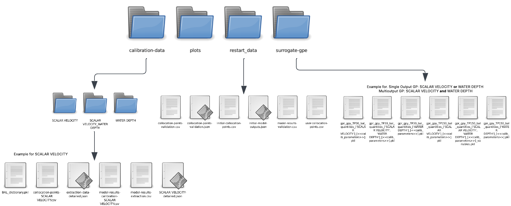

.. BAL Telemac

Complete Bayesian Active Learning (BAL) for Gaussian Process Emulator (GPE) using Telemac
=============================================================================================
A complete surrogate-assisted calibration using Gaussian Process and Bayesian Active Learning (BAL) is performed for a hydrodynamic model using Telemac and is launched with the main script as follows:

.. image:: _static/UML-bal-reduced.png
   :alt: UML complete surrogate assisted calibration
   :width: 80%
   :align: center

Telemac simulation folder
------------------------------

To run HydroBayesCal using Telemac, you need to have Telemac installed in your PC and all the necesary files to run a hydrodynamic model.
First, create a folder called **telemac_simulation** and copy the necessary files for a Telemac simulation into it:
For example, for a hydrodynamic numerical model you might require:

- **telemac.cas:** Numerical configuration of the hydrodynamic model.
- **liquid.liq:** Liquid boundary condition (flow inflow/outflow) (in case of unsteady flow, a .liq file is needed)
- **boundary-conditions.cli:** File that defines the type and location of the boundary conditions.
- **geometry.slf:** File that defines the mesh structure for the hydrodynamic model.
- **zones.tbl:** File that defines the roughness zones of the mesh.
- **rating-curve.txt:**: File that defines the stage-discharge rating curve of the outlet boundary condition.

.. admonition:: Note

    - *Please, before starting any BAL calibration, check that your hydrodynamic model runs properly.*
    - *Until now, the code cannot run sediment transport model with GAIA. Only hydrodynamic simulations are possible.*

OpenFoam simulation folder
------------------------------

Definition of HydroBayesCal parameters
---------------------------------------

A complete surrogate assisted calibration of a hydrodynamic model requires the definition of some parameters corresponding to the complex model (e.g. Telemac or OpenFoam) and parameters for the metamodel construction based on Gaussian Process.

complex_model instance:

.. code-block:: python

    complex_model = initialize_model(
        TelemacModel(
            friction_file="/path/to/friction_file.tbl",
            tm_xd="1",
            gaia_steering_file="",
            results_filename_base="results",
            control_file="control_file.cas",
            model_dir="/path/to/model_directory/telemac_simulation",
            res_dir="/path/to/results_directory/",
            calibration_pts_file_path="/path/to/calibration_points.csv",
            n_cpus=8,
            init_runs=15,
            calibration_parameters=["zone1", "zone2", "zone3", "ROUGHNESS COEFFICIENT OF BOUNDARIES", ],
            param_values=[[0.011, 0.79], [0.011, 0.79], [0.0016, 0.060], [0.018, 0.028]],
            extraction_quantities=["WATER DEPTH", "SCALAR VELOCITY", "TURBULENT ENERGY", "VELOCITY U", "VELOCITY V"],
            calibration_quantities= ["WATER DEPTH", "SCALAR VELOCITY"]
            dict_output_name="output-data",
            user_param_values=False,
            max_runs=30,
            complete_bal_mode=True,
            only_bal_mode=False,
            delete_complex_outputs=True,
            validation=False
        )
    )

In this example, the **Telemac** files are saved in **telemac_simulation** folder. The path to this folder is defined in ``model_dir``.
.. code::

    model_dir="/path/to/model_directory/telemac_simulation".

The prior assumptions for these uncertain calibration parameters are defined as four ranges in ``param_values`` following a uniform distribution limited by the minimum and maximum limits. The model is calibrated for three roughness zones and the roughness coefficients of the boundaries.
.. code::

    param_values=[[0.011, 0.79], [0.011, 0.79], [0.0016, 0.060], [0.018, 0.028]].

The measured data, stored in a `.csv` file, should consists of water depth and scalar velocity. Each of these quantities has a measurement error which is also assigned in the corresponding column in the .csv file. These quantities will be the calibration targets and are extracted from the model. The user-specified ``calibration_quantities``are ["WATER DEPTH", "SCALAR VELOCITY"].
.. code::

    calibration_quantities=["WATER DEPTH", "SCALAR VELOCITY"]

For more details on the assignment of complex model parameters, please refer to the section :ref:`HydroSimulations_class`.

Experiment Design Definition
----------------------------

The calibration model parameters are associated with uncertainty and are described as probability distributions.
To define the values of the input parameters, **HydroBayesCal** uses the classes `ExpDesigns` and `Input` from BayesValidRox:
`Priors, input space and experimental design <https://pages.iws.uni-stuttgart.de/inversemodeling/bayesvalidrox/input_description.html>`_

If the uncertain parameters are defined as distribution types, they must be specified as follows:

Example Usage
^^^^^^^^^^^^^

.. code-block:: python

    exp_design = setup_experiment_design(
        complex_model=full_complexity_model,
        tp_selection_criteria='dkl',
        parameter_distribution='uniform',
        parameter_sampling_method='sobol'
    )

This function returns an instance of the ``ExpDesigns`` class from BayesValidRox,
which will be used in subsequent steps.

The attribute ``exp_design.X`` stores the collocation points for the initial execution of the complex model.

Parameters
^^^^^^^^^^

**complex_model** : object
    An instance representing the hydrodynamic model to be used in the experiment.

**tp_selection_criteria** : str, optional
    The criteria for selecting new training points (TP) during the Bayesian Active Learning process.
    Default: ``'dkl'`` (relative entropy).

    Available options:
    * **"dkl"** - Relative Entropy (Kullback–Leibler divergence).
    * **"bme"** - Bayesian Model Evidence (LHS).

**parameter_distribution** : str, optional
    The criteria for selecting the parameter distribution.
    Default: ``'uniform'`` (uniform distribution).

**parameter_sampling_method** : str, optional
    The criteria for selecting the parameter sampling method.
    Default: ``'sobol'``.

   Available options:

   * **"random"** - Random sampling.
   * **"latin_hypercube"** - Latin Hypercube Sampling (LHS).
   * **"sobol"** - Sobol sequence sampling.
   * **"halton"** - Halton sequence sampling.
   * **"hammersley"** - Hammersley sequence sampling.
   * **"chebyshev(FT)"** - Chebyshev nodes (Fourier Transform-based).
   * **"grid(FT)"** - Grid-based sampling (Fourier Transform-based).
   * **"user"** - User-defined sampling. (Requires a user-defined .csv file with the sampling points.)

Returns
^^^^^^^^

**exp_design** : object
    An instance of the experiment design object configured with the specified model and selection criteria.

.. autofunction:: bal.setup_experiment_design

Run Complex Model with Experiment Design
-----------------------------------------

This step executes the hydrodynamic model for a given experiment design and returns
the collocation points (previously obtained in the experiment design) and the model outputs.
The collocation points serve as the input parameters for the initial model runs.

Example Usage
^^^^^^^^^^^^^

.. code-block:: python

    init_collocation_points, model_evaluations = run_complex_model(
        complex_model=complex_model,
        experiment_design=exp_design,
    )

Parameters
^^^^^^^^^^

**complex_model** : obj
    Instance representing the hydrodynamic model to be evaluated.

**experiment_design** : obj
    Instance of the experiment design object that specifies the settings for the experimental runs.

Returns
^^^^^^^^

**collocation_points** : array
    Contains the collocation points (parameter combination sets) with shape
    ``[number of runs x number of calibration parameters]`` used for model evaluations.

**model_outputs** : array
    Contains the model outputs. The shape of the array depends on the number of quantities:

    - **For 1 quantity**: ``[number of runs x number of locations]``
    - **For 2 quantities**: ``[number of runs x 2 * number of locations]``
      *(Each pair of columns contains the two quantities for each location.)*

Run Bayesian Active Learning Calibration
----------------------------------------

This step performs **stochastic calibration** of the Telemac hydrodynamic model using
**Surrogate-Assisted Bayesian Inversion**. The surrogate model is constructed with
**Gaussian Process Regression (GPR)**, supporting both **Single-Output GP** and **Multi-Output GP** formulations.

This approach enables:

- **Bayesian Model Inversion**, allowing uncertainty quantification of model input parameters
  through **Bayesian Inference**.
- **Iterative surrogate training**, where the GP metamodel is refined dynamically by adding new training points using
  **Bayesian Active Learning (BAL)** to improve calibration efficiency. The criteria for adding new training points is selected from **DKL (relative entropy)**, **BME (Bayesian Model Evidence)**
- **Methods by:** `Oladyshkin et al. (2020) <https://doi.org/10.3390/e22080890>`_.

Example Usage
^^^^^^^^^^^^^

.. code-block:: python
    run_bal_model(
        collocation_points=init_collocation_points,
        model_outputs=model_evaluations,
        complex_model=complex_model,
        experiment_design=exp_design,
        eval_steps=20,
        prior_samples=15000,
        mc_samples_al=2000,
        mc_exploration=1000,
        gp_library="gpy"
    )

Parameters
^^^^^^^^^^

**collocation_points** : array
    An array containing the collocation points used for model evaluations, with shape
    ``[number of initial runs x number of calibration parameters]``.

**model_outputs** : array
    Contains the outputs from the hydrodynamic model, with shape dependent on the number of quantities and locations.

**complex_model** : obj
    An instance representing the hydrodynamic model instance to be evaluated.

**experiment_design** : obj
    Contains the experiment design object.

**eval_steps** : int, optional
    Specifies how often the surrogate model is evaluated and saved in the surrogate model folder.
    Default is ``1`` (evaluates the surrogate model at every BAL iteration).
    Example: if 10 the surrogate model is evaluated every 10 BAL iterations.

**prior_samples** : int, optional
    The number of samples drawn from the prior distribution (prior pool).
    Default is ``10,000``.

**mc_samples_al** : int, optional
    The number of Monte Carlo samples used for the Bayesian inference process (taken from prior pool).
    Default is ``5,000``.

**mc_exploration** : int, optional
    The number of samples used for exploring the parameter space during the Bayesian Active Learning process. (from mc_samples_al)
    Default is ``1,000``.

**gp_library** : str, optional
    The Gaussian Process library to be used for modeling. Options include ``"gpy"`` (for GPyTorch) or ``"skl"`` (for SciKitLearn).
    Default is ``gpy``.

Returns
^^^^^^^^

**None**

The following files are saved in the user-defined results directory ``res_dir`` under
the name **auto-saved-results-HydroBayesCal**:

- **BAL_dictionary**: Dictionary and ``.pkl`` file containing the data from Bayesian Active Learning.
- **updated_collocation_points**: Array and ``.csv`` file containing all the collocation points (Initial + BAL-added).
- **model_outputs**: Files ``.csv`` and ``.json`` containing all model outputs obtained from the
  collocation points and required model variables.

.. _outputs-folder: outputs-folder

Surrogate-Assisted BAL Calibration Outputs
-------------------------------------------

The surrogate-assisted Bayesian Active Learning (BAL) calibration runs iteratively until the specified ``max_runs`` limit is reached.
Once the calibration process is completed, the output files are generated and organized into separate folders based on the type of data.

Each folder contains essential data that can be extracted or used for further analysis.
The generated folders and their contents are as follows:

**1. Calibration Data**
   Contains all calibration-related data for the specified calibration quantity/quantities.

   - **``BAL_dictionary.pkl``**:
     Stores Bayesian Active Learning data after iterations, including prior/posterior distributions, observations, errors,
     Bayesian Model Evidence (BME), and Relative Entropy (RE).

   - **``collocation-points-<CALIBRATION_QUANTITY>.csv``**:
     Lists the collocation points used during calibration, including both initial and BAL-added points for the specified ``<CALIBRATION_QUANTITY>``.

   - **``extraction-data-detailed.json``**:
     A JSON dictionary containing the output data from the complex model simulations for all collocation points
     and the variables in ``extraction_quantities``.

   - **``model-results-calibration-<CALIBRATION_QUANTITY>.csv``**:
     A CSV file storing model results for all collocation points and the specified ``<CALIBRATION_QUANTITY>``.

   - **``model-results-extraction.csv``**:
     Extracted model results from simulations for the variables defined in ``extraction_quantities``.

   - **``<CALIBRATION_QUANTITY>-detailed.json``**:
     A detailed JSON file containing extracted data for ``<CALIBRATION_QUANTITY>`` at each collocation point and location.

**2. Plots**
   This folder stores plots generated after the calibration process.
   The Python script **``plots.py``** is used to create these plots.

**3. Surrogate Models**
   Contains surrogate models developed during the calibration process. Inside this folder a subfolder will be created depending on the training point selection criteria.
   Inside the corresponding folder the surrogate models are saved as **pickle** files for further use.

   - **bal_bme**: Folder that stores the surrogate models trained with BME criteria.
   - **bal_dkl**: Folder that stores the surrogate models trained with DKL criteria.

**4. Restart Data**
   Stores data necessary for resuming the calibration process or stores independent sets of parameters with their respective outputs for surrogate validation.
   The following files are typically included:

    For resuming BAL calibration process:

    These files allow the continuation of the BAL calibration process. This is the training data for the initial surrogate model before BAL iterations.
    It is possible also to build the surrogate model with either **ALL** the restart data or just a **PART** of it. To use only a part of it, initialize the ``initial_runs`` with the desired number of initial training ponts.
   - **``initial-collocation-points.csv``**:
     Contains the initial parameter combinations used for surrogate training and further BAL calibration..
     The number of collocation points corresponds to the value assigned in ``init_runs``.

   - **``initial-outputs.json``**:
     A JSON dictionary storing initial outputs (defined in ``extraction_quantities``) from the full-complexity model at the collocation points.

   - **user-collocation-points.csv**:
     Contains the initial user-defined parameter combinations used for surrogate training and further BAL calibration.

     For validating surrogate model with independent collocation points:

   - **``collocation-points-validation.csv``**: Contains the parameter combinations used for surrogate validation, independent of the training data.
   - **``collocation-points-validation.json``**: Stores the corresponding model outputs associated with the validation collocation points.
   - **``model-results-validation.csv``**: Contains the model outputs obtained from evaluating the validation collocation points, used for assessing the surrogate model's accuracy.

---

These organized outputs ensure a structured post-processing workflow for analyzing the calibration process.

Methods by:
Oladyshkin, S., Mohammadi, F., Kroeker, I., & Nowak, W. (2020). Bayesian3 Active Learning for the Gaussian Process Emulator Using Information Theory. Entropy, 22(8), 890.
----------------------

#external_libraries Folder:
The library pputils-master by Pat Prodanovic (https://github.com/pprodano/pputils) is used to extract the results of the simulation file (.slf) into a .txt file, which is then stored in the results Folder.

#scripts Folder:
-auxiliary_fuctions_BAL: Auxiliary functions for the stochastic calibration of model using Surrogate-Assisted Bayesian inversion
- auxiliary_functions_telemac: Contains auxiliary functions used to modify the input and output of the telemac files. These functions are specific to the parameters that wanted to be changed at the time, but they can be used as a base on how to modify Telemac's input and output files
-init.py: Reference other folders.
