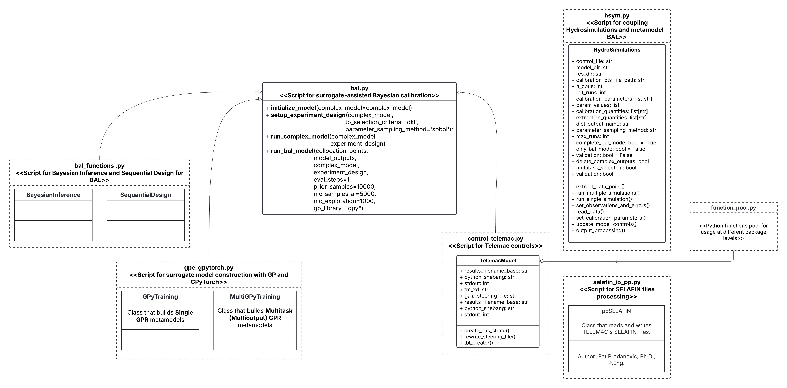

.. BAL Telemac

Complete Bayesian Active Learning (BAL) for the Gaussian Process Emulator (GPE) using Telemac
=============================================================================================
A complete surrogate-assisted calibration using Gaussian Process and Bayesian Active Learning (BAL) is performed for a hydrodynamic model using Telemac and is launched with the main script as follows:

Telemac simulation folder
------------------------------

To run HydroBayesCal using Telemac, you need to have Telemac and all the necesary files to run a hydrodynamic model.
Create a folder called **telemac_simulation** and copy the necessary files for a Telemac simulation into it:
For example (hydrodynamic numerical model):

- **telemac.cas:** Numerical configuration of the hydrodynamic model.
- **liquid.liq:** Liquid boundary condition (flow inflow/outflow) (in case of unsteady flow, a .liq file is needed)
- **boundary-conditions.cli:** File that defines the type and location of the boundary conditions.
- **geometry.slf:** File that defines the mesh structure for the hydrodynamic model.
- **zones.tbl:** File that defines the roughness zones of the mesh.
- **rating-curve.txt:**: File that defines the stage-discharge rating curve of the outlet boundary condition.

Until now, the code cannot run sediment transport model with GAIA. Only hydrodynamic simulations are possible.

OpenFoam simulation folder
------------------------------

Definition of HydroBayesCal parameters
---------------------------------------

A complete surrogate assisted calibration of a hydrodynamic model requires the definition of some parameters corresponding to the complex model (e.g. Telemac or OpenFoam) and parameters for the metamodel construction based on Gaussian Process.

complex_model instance:

.. code-block:: python

    complex_model = initialize_model(
        TelemacModel(
            friction_file="/path/to/friction_file.tbl",
            tm_xd="1",
            gaia_steering_file="",
            results_filename_base="results",
            control_file="control_file.cas",
            model_dir="/path/to/model_directory/telemac_simulation",
            res_dir="/path/to/results_directory/",
            calibration_pts_file_path="/path/to/calibration_points.csv",
            n_cpus=8,
            init_runs=15,
            calibration_parameters=["zone1", "zone2", "zone3", "ROUGHNESS COEFFICIENT OF BOUNDARIES", ],
            param_values=[[0.011, 0.79], [0.011, 0.79], [0.0016, 0.060], [0.018, 0.028]],
            extraction_quantities=["WATER DEPTH", "SCALAR VELOCITY", "TURBULENT ENERGY", "VELOCITY U", "VELOCITY V"],
            calibration_quantities= ["WATER DEPTH", "SCALAR VELOCITY"]
            dict_output_name="output-data",
            user_param_values=False,
            max_runs=30,
            complete_bal_mode=True,
            only_bal_mode=False,
            delete_complex_outputs=True,
            validation=False
        )
    )

In this example, the **Telemac** files are saved in **telemac_simulation** folder. The path to this folder is defined in ``model_dir``.
.. code::

    model_dir="/path/to/model_directory/telemac_simulation".

The prior assumptions for these uncertain calibration parameters are defined as four ranges in ``param_values`` following a uniform distribution limited by the minimum and maximum limits. The model is calibrated for three roughness zones and the roughness coefficients of the boundaries.
.. code::

    param_values=[[0.011, 0.79], [0.011, 0.79], [0.0016, 0.060], [0.018, 0.028]].

The measured data, stored in a `.csv` file, should consists of water depth and scalar velocity. Each of these quantities has a measurement error which is also assigned in the corresponding column in the .csv file. These quantities will be the calibration targets and are extracted from the model. The user-specified ``calibration_quantities``are ["WATER DEPTH", "SCALAR VELOCITY"].
.. code::

    calibration_quantities=["WATER DEPTH", "SCALAR VELOCITY"]

For more details on the assignment of complex model parameters, please refer to the section :ref:`HydroSimulations_class`.

Experiment design definition
----------------------------
The calibration model parameters are associated with uncertainty and are described as probability distributions.
To define the values of the input parameters, **HydroBayesCal** uses the classes `ExpDesigns` and `Input` from BayesValidRox:`Priors, input space and experimental design <https://pages.iws.uni-stuttgart.de/inversemodeling/bayesvalidrox/input_description.html>`_
If the uncertain parameters are defined as distribution types, they must be defined as:

exp_design instance:

.. code-block:: python

    exp_design = setup_experiment_design(
        complex_model=full_complexity_model,
        tp_selection_criteria='dkl',
        parameter_distribution='uniform',
        parameter_sampling_method='sobol'
    )

.. autofunction:: bal_telemac.setup_experiment_design

Run complex model with experiment design
----------------------------------------

.. code-block:: python

    init_collocation_points, model_evaluations= run_complex_model(
        complex_model=full_complexity_model,
        experiment_design=exp_design,
    )

Run 'Bayesian Active Learning
-----------------------------

.. code-block:: python
    run_bal_model(
        collocation_points=init_collocation_points,
        model_outputs=model_evaluations,
        complex_model=complex_model,
        experiment_design=exp_design,
        eval_steps=20,
        prior_samples=15000,
        mc_samples_al=2000,
        mc_exploration=1000,
        gp_library="gpy"
    )

Methods by:
Oladyshkin, S., Mohammadi, F., Kroeker, I., & Nowak, W. (2020). Bayesian3 Active Learning for the Gaussian Process Emulator Using Information Theory. Entropy, 22(8), 890.
----------------------

To run the code, run the main_GPE_BAL_telemac.py file using the main folder as a current directory from a console/terminal in which Telemac and GAIA have already been compiled. It is not recommended to run the code from PyCharm as PyCharm uses a kind of additional virtual environment when it fires up its Terminal, and because Telemac has its own environment and APIs, those might be conflicting with PyCharm. 

#main Folder: 
-main_GPE_BAL_telemac.py: Stochastic calibration of a Telemac2d hydro-morphodynamic model using  Surrogate-Assisted Bayesian inversion. The surrogate model is created using Gaussian Process Regression.
-calibration_points.txt: This file contains the index of the mesh nodes that will be used for the calibration, the respective field measurement (water elevation, bottom elevation, ...) and its associated error (measurement error). 
-loocv_error_variance.txt: Contains an additional leave-one-out cross-validation error for each calibration point that accounts for the fact that the surrogate model is an approximation of the full-complexity model.
-init.py: Reference other folders.
- Files necessary to run the hydro-morphodynamic model using Telemac2D and GAIA: 
	- bc_liquid.liq: Liquid boundary condition (flow, sediment or tracers inflow/outflow)
	- bc_steady_tel.cli: File that defines the type and location of the boundary conditions.
	- geo_banda.slf: File that defines the mesh structure for the hydro-morphodynamic model. 
	-run_liquid_gaia.cas: Numerical configuration of the sediment transport model.
	- run_liquid_tel.cas: Numerical configuration of the hydrodynamic model. 

#results Folder:
Here the files that are going to be used as initial training points for the creation of the surrogate model are stored. In this case, 15 initial training points (15 runs of the full-complexity hydro-morphodynamic model) will be used to create the surrogate model. 
- parameter_file.txt: Contains the parameter combination associated with each training point.
- PCX_XXX.txt: Contains, for each parameter combination listed in parameter_file.txt, the associated modelled results (water elevation, bottom elevation, ...). 
In each iteration, the BAL technique selects a new training point to improve the surrogate quality. Therefore, a new hydro-morphodynamic simulation will be run using the newly defined training point parameters, the parameter_file.txt will be updated, and a new .txt file with the values of a calibration variable (water elevation, bottom elevation, ...) in the nodes listed in calibration_points.txt will be generated and stored in this folder. 

#simulations Folder: 
In each iteration, the BAL technique selects a new training point to improve the surrogate quality. Therefore, a new hydro-morphodynamic simulation will be run using the newly defined training point parameters. The simulation files produced by telemac are going to be stored in this folder. 

#external_libraries Folder:
The library pputils-master by Pat Prodanovic (https://github.com/pprodano/pputils) is used to extract the results of the simulation file (.slf) into a .txt file, which is then stored in the results Folder.

#scripts Folder:
-auxiliary_fuctions_BAL: Auxiliary functions for the stochastic calibration of model using Surrogate-Assisted Bayesian inversion
- auxiliary_functions_telemac: Contains auxiliary functions used to modify the input and output of the telemac files. These functions are specific to the parameters that wanted to be changed at the time, but they can be used as a base on how to modify Telemac's input and output files
-init.py: Reference other folders.
